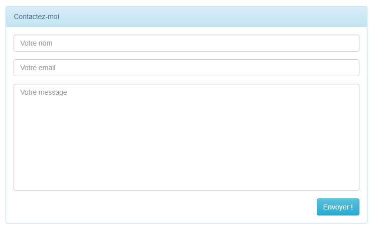

# Jour 4

## Objectifs

- Validation de champs de formulaire
- Affichage d'un message d'erreur (si un des champs n'est pas correctement rempli)
- Ajout d'une nouvelle langue pour les messages d'erreur
- Récupération des valeurs déjà saisies lors d'erreurs durant la validation d'un formulaire
- Envoi de mail

## Scénario

Voici le scénario de ce que nous allons mettre en place.

Le client demande un formulaire.
Le serveur retourne le formulaire demandé au client.
Le client remplit le formulaire et le soumet au serveur.
Tant que les champs du formulaire ne sont pas remplis correctement, le serveur retourne le formulaire avec des messages invitant l'utilisateur à saisir correctement les informations.
Une fois que les champs ont été remplis correctement, le serveur traite les données reçues.
Le serveur envoie ensuite un mail (p.ex. à un administrateur) avec les données reçues, puis informe l'utilisateur que les informations qu'il a envoyées ont été traitées.

Créons un template (qui utilise Bootstrap pour le rendu graphique)

## Vue Formulaire

Voici le contenu du template ( `template_contact.blade.php` ) : 

```php+HTML
<!doctype html>
<html lang='fr'>
    <head>
        <meta charset="UTF-8">
        <meta name="viewport" content="width=device-width">
        <title>
            Mon joli formulaire
        </title>
        <link media="all" type="text/css" rel="stylesheet" href="https://netdna.bootstrapcdn.com/bootstrap/3.3.6/css/bootstrap.min.css">
        <link media="all" type="text/css" rel="stylesheet" href="https://netdna.bootstrapcdn.com/bootstrap/3.3.6/css/bootstrap-theme.min.css">
        <style> textarea {resize:none} </style>
    </head>
    <body>
        @yield('contenu')
    </body>
</html>
```


Et voici la vue basée sur le template ( `view_formulaire_contact.blade.php` )

```php+HTML
@extends('template_contact')

@section('contenu')
<br>
<div class="col-sm-offset-3 col-sm-6">
    <div class="panel panel-info">
        <div class="panel-heading">Contactez-moi</div>
        <div class="panel-body">
            <form method="POST" action="{{ url('contact') }}" accept-charset="UTF-8">
                @csrf
                <div class="form-group ">
                    <input class="form-control" placeholder="Votre nom" name="nom" type="text">
                    {!! $errors->first('nom', '<small class="help-block">:message</small>') !!}
                </div>
                <div class="form-group ">
                    <input class="form-control" placeholder="Votre email" name="email" type="email">
                    {!! $errors->first('email', '<small class="help-block">:message</small>') !!}
                </div>
                <div class="form-group ">
                    <textarea class="form-control" placeholder="Votre message" name="texte" cols="50" rows="10"></textarea>
                    {!! $errors->first('texte', '<small class="help-block">:message</small>') !!}
                </div>
                <input class="btn btn-info pull-right" type="submit" value="Envoyer !">
            </form>
        </div>
    </div>
</div>                 
@endsection
```

## Route Formulaire

Créons maintenant la route (`get`)  `contact` pour obtenir notre formulaire ( `web.php` )

```php
use App\Http\Controllers\ContactController;
//...
Route::get('contact', [ContactController::class,'rendFormulaire']);
```

## Contrôleur

Puis la méthode `rendFormulaire` dans le contrôleur ( `ContactController.php` )

```php
 public function rendFormulaire() {
	return view('view_formulaire_contact');
 }
```

Voilà qui termine la première étape.

Il nous suffit de compléter l'adresse :

```
http://localhost...    .../contact
```

et de la soumettre à notre navigateur pour obtenir le résultat suivant :



Il nous reste à construire la partie permettant de traiter les données provenant du formulaire.

Créons une nouvelle route (post) `contact` 

## Route Traite Formulaire

```php
Route::post('contact', [ContactController::class,'valideEtTraiteFormulaire']);
```

## Classe pour validation des champs d'un formulaire

Avant d'implémenter la méthode `valideEtTraiteFormulaire` nous allons introduire la nouveauté du jour. Il s'agit d'une classe personnalisée basée sur la classe `FormRequest`.

Créons cette nouvelle classe qui va contenir le code permettant de valider les champs du formulaire.

Voici la commande permettant de créer cette classe :

```
php artisan make:request ContactRequest
```

Cette commande nous a créé un nouveau fichier (`ContactRequest.php`) dans le répertoire 
`app/Http/Requests/` avec le contenu suivant :

```php
<?php

namespace App\Http\Requests;

use Illuminate\Foundation\Http\FormRequest;

class ContactRequest extends FormRequest
{
    /**
     * Determine if the user is authorized to make this request.
     *
     * @return bool
     */
    public function authorize()
    {
        return false;
    }

    /**
     * Get the validation rules that apply to the request.
     *
     * @return array
     */
    public function rules()
    {
        return [
            //
        ];
    }
}
```

Modifions ce fichier pour indiquer à Laravel que l'utilisateur est autorisé d'utiliser cette classe (``ContactRequest``) en passant la valeur de retour de la méthode `authorize()` à `true` et ajoutons les contraintes sur les différents champs de notre formulaire (méthode `rules()`).

```php
<?php

namespace App\Http\Requests;

use Illuminate\Foundation\Http\FormRequest;

class ContactRequest extends FormRequest
{
    /**
     * Determine if the user is authorized to make this request.
     *
     * @return bool
     */
    public function authorize()
    {
        return true;	// Ne pas oublier de passer le retour à true !!!!
    }

    /**
     * Get the validation rules that apply to the request.
     *
     * @return array
     */
    public function rules() {
    	return [
        	'nom'=>'required|min:3|max:20|alpha_dash',
        	'email'=>'required|email',
        	'texte'=>'required|max:250'
    	];
	}
}
```

Nous indiquons ici, que le champ ```nom``` est requis et doit comporter enter 3 et 20 caractères alphanumériques, que ```email``` est nécessaire et doit être valide et enfin que le champ ```texte```, obligatoire, doit contenir au maximum 250 caractères.

Nous pouvons maintenant ajouter la méthode `valideEtTraiteFormulaire` au contrôleur :
notez au passage le type du paramètre de la méthode ;-)
Remarque : Il faut changer l'adresse email avec la votre dans ce code ci-dessous ;-)

```php
public function valideEtTraiteFormulaire(ContactRequest $request) {
    
    // Envoi d'un mail
    Mail::send('view_contenu_email', $request->all(), function($message){
		$message->to('votrePrenom.votreNom@heig-vd.ch')->subject('Laravel (Contact)');
        //             ^^^^^^^^^^^ ^^^^^^^^
        //       Il faut changer le prénom et le nom !!!
    });
    
    // Confirmation de réception
    return view('view_confirmation');
}
```

Attention à bien ajouter les `use` suivants dans le contrôleur (sans quoi cela ne fonctionnerait pas !)

```php
use App\Http\Requests\ContactRequest;
use Mail;
```

- `use App\Http\Requests\ContactRequest;`	// pour pouvoir utiliser notre nouvelle classe de validation
- `use Mail;`                                                     // pour pouvoir envoyer un mail

Voici donc le contenu de notre contrôleur ( `ContactController` ) :

```php
<?php

namespace App\Http\Controllers;

use App\Http\Requests\ContactRequest;
use Mail;

class ContactController extends Controller {

    public function rendFormulaire() {
		return view('view_formulaire_contact');
	}

    public function valideEtTraiteFormulaire(ContactRequest $request) {
		
    	// Envoi d'un mail
    	Mail::send('view_contenu_email', $request->all(), function($message){
			$message->to('votrePrenom.votreNom@heig-vd.ch')->subject('Laravel (Contact)');
    		//             ^^^^^^^^^^^ ^^^^^^^^
    		//       Il faut changer le prénom et le nom !!!
   	 	});
    	
        // Confirmation de réception
        return view('view_confirmation');
	}
}
```

La méthode `valideEtTraiteFormulaire` va récupérer les données du formulaire grâce à `$request` et les envoyer toutes  `$request->all()`  à la vue `vueEmailContact`

## Configuration messagerie

Pour que l'envoi d' e-mail fonctionne, il faut que Laravel soit configuré correctement.

Il faut compléter le fichier `.env` (qui se trouve à la racine) de l'application pour que Laravel puisse utiliser la messagerie de votre choix (p. ex. celle de l'école)

> Remarque importante :
>
> Attention à ne pas laisser ce fichier n'importe où ! (Ex : `Github`)

```php
...
MAIL_MAILER=smtp
MAIL_HOST=smtp.heig-vd.ch
MAIL_PORT=587
MAIL_USERNAME= !!! votre_username_école !!!
MAIL_PASSWORD= !!! votre_mot_de_passe_école !!!
MAIL_ENCRYPTION=tls
MAIL_FROM_ADDRESS= !!! votre_adresse_email_de_l_école !!!
MAIL_FROM_NAME="${APP_NAME}"
...
```

Il ne nous reste plus qu'à construire : 

- une vue pour le contenu de l'e-mail, 
- une vue pour informer le client que ses données ont bien été traitées.

## Vue (Contenu Email)

Commençons par la vue destinée au contenu de l'e-mail (`view_contenu_email.blade.php`) :

```php+HTML
<!doctype html>
<html lang='fr'>
    <head>
        <meta charset="UTF-8">
    </head>
    <body>
        <h2>Prise de contact</h2>
        <p>Voici les informations reçues :</p>
        <ul>
            <li><strong>Nom</strong> : {{$nom}}</li>
            <li><strong>Email</strong> : {{$email}}</li>
            <li><strong>Message</strong> : {{$texte}}</li>
        </ul>
    </body>
</html>
```

## Vue (Confirmation de réception des informations)


Créons maintenant la vue de confirmation de réception des informations (`view_confirmation.blade.php`)

```php+HTML
@extends('template_contact')

@section('contenu')
<br>
<div class="col-sm-offset-3 col-sm-6">
    <div class="panel panel-info">
        <div class="panel-heading">Information</div>
        <div class="panel-body">Merci, vos informations ont bien été transmises à l'administrateur</div>
    </div>
</div>
@endsection

```

Nous avons terminé l'implémentation. Il ne nous reste plus qu'à tester le tout.

Pour tester que la validation des champs fonctionne, il suffit de cliquer sur le bouton "Envoyer" sans remplir de champs.

Le traitement des informations (envoi du mail et affichage de la confirmation) ne se fera que lorsque tous les champs seront corrects.

> Remarque : Si une erreur survient lors de l'envoi du mail, tapez la commande suivante en ligne de commande puis réessayez.
>
> ```
> php artisan config:cache
> ```

## Ajout d'une nouvelle langue

Ce que nous pouvons observer, c'est que les messages d'erreurs retournés par Laravel sont en anglais.

Ces messages proviennent du fichier `\resources\lang\en\validation.php`

Nous allons voir maintenant comment ajouter une nouvelle langue pour avoir des messages d'erreurs en français `\resources\lang\fr\...`

Pour ce faire, nous allons ajouter une nouvelle librairie de gestion des langues à notre application Laravel [source](https://packagist.org/packages/andrey-helldar/laravel-lang-publisher)

L'installation de cette librairie se fait en ligne de commande (dans le répertoire `\laravel` de notre application)

```
composer require andrey-helldar/laravel-lang-publisher
```

Il faut patienter un bon moment pour permettre le téléchargement et surtout l'installation des fichiers nécessaires ...

Une fois la libraire installée, il ne reste plus qu'à lui demander d'installer la langue désirée

```
php artisan lang:install fr
```

 Le message suivant nous indique que la nouvelle langue `fr` est disponible

```
+--------+----------------+--------+
| Locale | Filename       | Status |
+--------+----------------+--------+
| fr     | auth.php       | copied |
| fr     | pagination.php | copied |
| fr     | passwords.php  | copied |
| fr     | validation.php | copied |
+--------+----------------+--------+
```

> Remarque : Il arrive parfois qu'un message d'erreur survienne, dans ce cas essayez les commandes suivantes en ligne de commande :
>
> ```
> composer update
> php artisan config:cache
> ```

Maintenant que les fichiers sont disponibles, il faut indiquer à Laravel la langue qu'il doit utiliser.

Dans le répertoire `\config` se trouve un fichier nommé `app.php` qui permet de configurer notre application.

Modifions la ligne

```
'locale' => 'en',
```

en 

```
'locale' => 'fr',
```

Notre application affiche désormais les messages en français. :slightly_smiling_face:

## Récupération des anciennes valeurs entrées dans le formulaire

Pour l'instant si un ou plusieurs champs sont correctement rempli mais qu'il subsiste une erreur de saisie dans le formulaire nous perdons les informations entrées. Laravel possède une solution pour récupérer les anciennes valeurs saisies à l'aide de : `old('nom_du_champ_du_formulaire')` 

Voici une nouvelle version de la vue `view_formulaire_contact.blade.php`

```html
@extends('template_contact')

@section('contenu')
<br>
<div class="col-sm-offset-3 col-sm-6">
    <div class="panel panel-info">
        <div class="panel-heading">Contactez-moi</div>
        <div class="panel-body">
            <form method="POST" action="{{ url('contact') }}" accept-charset="UTF-8">
                @csrf
                <div class="form-group ">
                    <input class="form-control" placeholder="Votre nom" name="nom" type="text" value="{{old('nom')}}">
                    {!! $errors->first('nom', '<small class="help-block">:message</small>') !!}
                </div>
                <div class="form-group ">
                    <input class="form-control" placeholder="Votre email" name="email" type="email" value="{{old('email')}}">
                    {!! $errors->first('email', '<small class="help-block">:message</small>') !!}
                </div>
                <div class="form-group ">
                    <textarea class="form-control" placeholder="Votre message" name="texte" cols="50" rows="10">{{old('texte')}}</textarea>
                    {!! $errors->first('texte', '<small class="help-block">:message</small>') !!}
                </div>
                <input class="btn btn-info pull-right" type="submit" value="Envoyer !">
            </form>
        </div>
    </div>
</div>                 
@endsection
```

Notre formulaire récupère maintenant les anciennes valeurs des champs saisis au cas où un des champs ne contient pas ce qui est attendu.

## Résumé des compétences du jour

- Nous savons comment valider les champs d'un formulaire [Documentation Laravel](https://laravel.com/docs/8.x/validation#creating-form-requests) [Liste des validateurs](https://laravel.com/docs/8.x/validation#available-validation-rules)
- Nous savons comment afficher des messages d'erreurs (de plus dans la langue de notre choix)
- Nous savons comment récupérer les anciennes valeurs d'un formulaire si la validation ne s'est pas bien passée.
- Nous savons comment envoyer des e-mail.